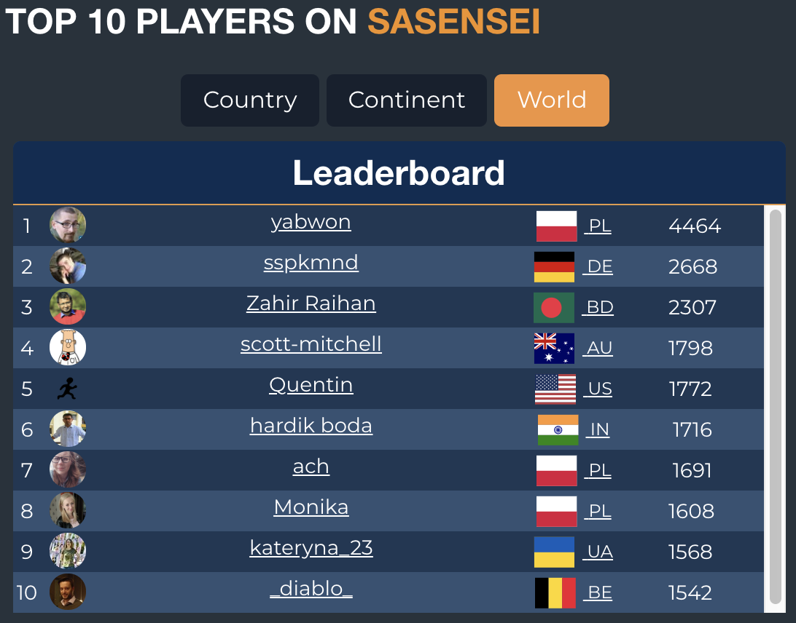

# { .container-sugg }

  SU GG

# Sponsors for today's Meetup

 

:::::::::::::: {.columns}
::: {.column width="50%"}

{ style="background:none; border:none; box-shadow:none;" }

:::
::: {.column width="50%"}

{ style="background:none; border:none; box-shadow:none;" }

:::
::::::::::::::

# Social

- [LinkedIn](https://www.linkedin.com/company/sas-user-group-germany/)
- [Meetup](https://www.meetup.com/sas-user-group-germany/)
- [sasusergg@gmail.com](mailto:sasusergg@gmail.com)
- [Slack](https://sug-germany.slack.com)

# Survey

 

<https://www.surveymonkey.de/r/K7PQT8P>

---

<!-- # SAS User Groups in Europe -->

:::::::::::::: {.columns}
::: {.column width="50%"}

###### UK & Ireland

[LinkedIn](https://www.linkedin.com/company/suguki/) [meetup](https://www.meetup.com/suguki/)

###### Belgium & Luxemburg

[LinkedIn](https://www.linkedin.com/company/sas-user-group-belux/) [meetup](https://www.meetup.com/BeLux-SAS-User-Group/)

:::
::: {.column width="50%"}

###### Germany

[LinkedIn](https://www.linkedin.com/company/sas-user-group-germany/) [meetup](https://www.meetup.com/sas-user-group-germany/)

###### Poland

[LinkedIn](https://www.linkedin.com/groups/8675451)

:::
::::::::::::::

---

### Greeting

Tell us several sentences about yourself:

- You could start from your name 😊
- Where do you work?
- What kind of things do you do?
- What is your interest in SAS software?

---

<!-- [KSFE](http://ksfe-ev.de/cms/) -- **K**ooperation der **S**AS Anwender in **F**orschung und **E**ntwicklung e.V. -->

###### KSFE-Konferenz 07.-08. März 2019 in Berlin

<https://ksfe-ev.de/2019/>

---

###### Sasensei quizz (Lua, SAS Macro, regex questions)

<https://sasensei.com/test/131>

{ height=500px style="background:none; border:none; box-shadow:none;" }
